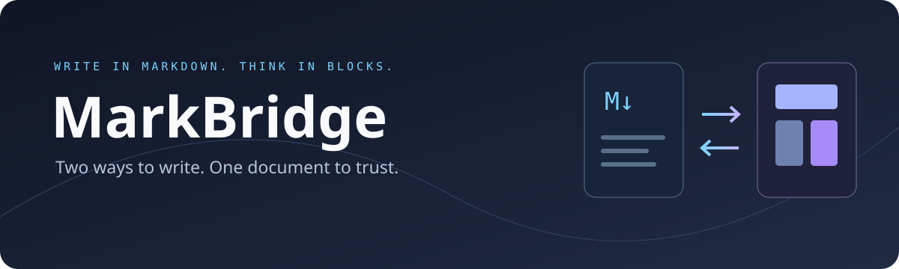
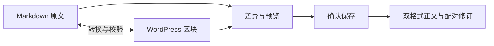

<p align="center"></p>

<p align="center">
  <a href="LICENSE"></a>
  
  
  
</p>

<p align="center"><strong>用 Markdown 写作，用区块调整。保存时，让两种格式保持一致。</strong></p>
<p align="center"><a href="#开始使用">开始使用</a> · <a href="docs/index.md">文档</a> · <a href="docs/INSTALL.md">安装</a> · <a href="CONTRIBUTING.md">参与开发</a> · <a href="CHANGELOG.md">更新记录</a></p>

## 为什么是 MarkBridge？

Markdown 适合专注写作，WordPress 区块适合直观调整。问题通常出在切换之后：原文与页面各自变成了一个版本，恢复旧稿时还可能只恢复其中一份。

MarkBridge 把它们放回同一次编辑流程：**先转换，检查差异与预览，再一起保存。** 无法可靠转换的内容会明确提示，避免静默丢失格式或覆盖新修改。

## 你能用它做什么

- **在两种编辑方式间切换。** 导入 `.md`、编辑 Markdown，或从当前区块生成 Markdown；提交前查看差异。
- **把修订一起恢复。** Markdown 与区块成对保存、成对恢复，检测版本冲突与已知旧文件覆盖。
- **写公式，也看得清公式。** 自托管 MathJax；选中段落后预览整段行内公式，块级公式单独预览，代码里的美元符号保持原样。
- **沿用 WordPress 权限。** 支持草稿、待审核、私密、公开与特色图片，普通作者按已有权限操作。
- **让评论继续使用 Markdown。** 保留链接、加粗、代码和任务标记；前台提供代码高亮、复制与 Unicode 表情。
- **接入文件工作流。** 文件来源文章可绑定可信源文件；配置受信目标后，后台可在权限和版本校验通过时预览并写回，未配置目标时保留只读查看。



## 开始使用

**当前为 `1.0.2`，面向能管理服务器的 WordPress 站点。** 它需要一个私有 Node.js 转换运行环境和 Linux 沙箱，不能只上传 ZIP 就完成配置。当前未提交 WordPress.org 插件目录。

1. 按照 [安装指南](docs/INSTALL.md) 构建插件、准备私有转换运行环境并启用。
2. 打开后台 **工具 → Markdown 编辑桥**，输入稳定文档 ID、标题和 Markdown。
3. 点击 **查看差异与预览**，确认后保存双格式。
4. 再次打开文章，通过编辑器底部工具栏选择 Markdown 编辑、区块预览或历史恢复。

原生区块文章继续使用 WordPress 原生编辑器。历史内容转换是单独、显式的操作，启用插件不会自动批量迁移或发布文章。

## 删除与恢复文章

导入后的文章仍由 WordPress 管理。在 **文章 → 所有文章** 中找到它，点击 **移至回收站**。需要恢复时进入 **回收站 → 还原**；确认不再需要后，可在回收站永久删除。

移入回收站不会丢弃 Markdown 与区块两种正文，编辑桥列表不显示回收站文章。文件来源文章的外部源文件不会随 WordPress 文章一起删除，需另行维护同步映射。

## 支持范围

| 内容                                 | 当前支持                           |
| ------------------------------------ | ---------------------------------- |
| 段落、标题、引用、分隔线             | 支持                               |
| 有序 / 无序 / 嵌套列表、表格         | 支持；超出可往返范围的样式会被拒绝 |
| 链接、图片、行内代码、代码块、删除线 | 支持                               |
| 行内与块级 TeX 公式                  | 支持；保留公式源码                 |
| 受限 HTML、`more` 分隔               | 支持；执行 HTML 策略检查           |
| 任意第三方区块、脚注、正文任务列表   | 暂不支持；评论任务标记单独支持     |
| 后台修改后写回已有绑定 Markdown 文件 | 配置受信目标后支持；未配置时只读   |

“可往返”指受支持表示之间保持内容及语义；不承诺任意 Markdown 扩展、所有 HTML 或第三方区块都能无损转换。

## 后续计划

统一发行与正式版验收正在实施，原 1.0.0 候选及边界见 [版本路线](docs/plans/active/ROADMAP.md)。计划与实际验收结果分别记录，未完成项不代表已提供的功能。

## 开发

```sh
npm ci
python3 -m venv .venv
.venv/bin/pip install -r requirements-dev.txt
npm run format
npm run build
npm run check
npm run package
```

发行打包要求已提交的干净工作树；完整自动检查见 [发布流程](docs/RELEASING.md)。

Node.js 使用 **24 LTS（24.15.0+）**。格式规范、运行测试和目录说明见 [CONTRIBUTING.md](CONTRIBUTING.md)。PHP 使用 4 空格与 PER-CS 式括号；JS/CSS/JSON 使用 2 空格；目标 100 列。

构建得到 `dist/markbridge-1.0.2.zip`。仓库保留可读源码，构建产物与第三方文件不参与手工格式化。完整运行测试需要按安装指南准备与目标 WordPress 匹配的私有运行环境。

## 许可证与致谢

项目采用 **[GPL-3.0-or-later](LICENSE)**。旧代码块还原逻辑改编自 [WP Editor.md 10.2.1](https://github.com/LuRenJiasWorld/WP-Editor.md)，保留其来源与许可。

感谢 WordPress / Gutenberg、markdown-it、MathJax、Prism、clipboard.js 与 emojilib。第三方组件继续遵循各自许可证，详见 [NOTICE.md](NOTICE.md)。

---

<p align="center">Markdown ↔ Blocks · Preview before saving · Keep the source</p>
