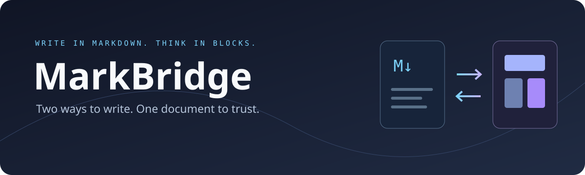
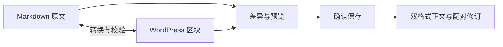

<p align="center"></p>

<p align="center">
  <a href="LICENSE"></a>
  
  
  
</p>

<p align="center"><strong>用 Markdown 写作，用区块调整。保存时，让两种格式保持一致。</strong></p>
<p align="center"><a href="#开始使用">开始使用</a> · <a href="docs/index.md">文档</a> · <a href="docs/INSTALL.md">安装</a> · <a href="CONTRIBUTING.md">参与开发</a> · <a href="CHANGELOG.md">更新记录</a></p>

## 为什么是 MarkBridge？

Markdown 适合专注写作，WordPress 区块适合直观调整。问题通常出在切换之后：原文与页面各自变成了一个版本，恢复旧稿时还可能只恢复其中一份。

MarkBridge 把它们放回同一次编辑流程：**先转换，检查差异与预览，再一起保存。** 无法可靠转换的内容会明确提示，避免静默丢失格式或覆盖新修改。

## 你能用它做什么

- **在两种编辑方式间切换。** 导入 `.md`、编辑 Markdown，或从当前区块生成 Markdown；提交前查看差异。
- **把修订一起恢复。** Markdown 与区块成对保存、成对恢复，检测版本冲突与已知旧文件覆盖。
- **写公式，也看得清公式。** 自托管 MathJax；段落和块级公式可预览。前台点击公式或用键盘打开阅读弹窗，放大查看并复制 TeX；代码里的美元符号保持原样。
- **沿用 WordPress 权限。** 支持草稿、待审核、私密、公开与特色图片，普通作者按已有权限操作。
- **让评论继续使用 Markdown。** 保留链接、加粗、代码和任务标记；前台提供代码高亮、复制与 Unicode 表情。
- **接入文件工作流。** 文件来源文章可绑定可信源文件；配置受信目标后，后台可在权限和版本校验通过时预览并写回，未配置目标时保留只读查看。


```mermaid
flowchart LR
    M[Markdown 原文] <-->|转换与校验| B[WordPress 区块]
    M --> P[差异与预览]
    B --> P
    P --> S[确认保存]
    S --> R[双格式正文与配对修订]
```

## 开始使用

**本源码版本为 `1.1.0`，面向能管理服务器的 WordPress 站点。** 它需要一个私有 Node.js 转换运行环境和 Linux 沙箱，不能只上传 ZIP 就完成配置。当前未提交 WordPress.org 插件目录。

1. 按照 [安装指南](docs/INSTALL.md) 构建插件、准备私有转换运行环境并启用。
2. 打开后台 **工具 → Markdown 编辑桥**，输入稳定文档 ID、标题和 Markdown。
3. 点击 **查看差异与预览**，确认后保存双格式。
4. 再次打开文章，通过编辑器底部工具栏选择 Markdown 编辑、区块预览或历史恢复。

原生区块文章继续使用 WordPress 原生编辑器。历史内容转换是单独、显式的操作，启用插件不会自动批量迁移或发布文章。

## 删除与恢复文章

导入后的文章仍由 WordPress 管理。在 **文章 → 所有文章** 中找到它，点击 **移至回收站**。需要恢复时进入 **回收站 → 还原**；确认不再需要后，可在回收站永久删除。

移入回收站不会丢弃 Markdown 与区块两种正文，编辑桥列表不显示回收站文章。文件来源文章的外部源文件不会随 WordPress 文章一起删除，需另行维护同步映射。

## 支持范围

| 内容                                 | 当前支持                                        |
| ------------------------------------ | ----------------------------------------------- |
| 段落、标题、引用、分隔线             | 支持                                            |
| 有序 / 无序 / 嵌套列表、表格         | 支持；超出可往返范围的样式会被拒绝              |
| 链接、图片、行内代码、代码块、删除线 | 支持                                            |
| 行内与块级 TeX 公式                  | 支持；保留公式源码                              |
| 受限 HTML、`more` 分隔               | 支持；执行 HTML 策略检查                        |
| 正文任务列表                         | 支持已完成/未完成、混合、嵌套与多段落；前台只读 |
| 命名脚注                             | 支持引用、重复引用和多段定义；不支持匿名脚注    |
| 任意第三方区块                       | 暂不支持                                        |
| 后台修改后写回已有绑定 Markdown 文件 | 配置受信目标后支持；未配置时只读                |

“可往返”指受支持表示之间保持内容及语义；不承诺任意 Markdown 扩展、所有 HTML 或第三方区块都能无损转换。

## 后续计划

统一发行、新建文章导入与受限源文件写回已实现。本分支已实现 [浏览器回归与长文差异、冲突处理](docs/plans/completed/EDITOR-REVIEW-REGRESSION.md)、[公式阅读工具](docs/plans/completed/MATH-READING.md)、[正文任务列表](docs/plans/completed/TASK-LISTS.md)与[脚注](docs/plans/completed/FOOTNOTES.md)，均纳入 1.1.0；原完成标准保留在 [历史路线](docs/plans/completed/ROADMAP.md)。

## 开发

```sh
npm ci
python3 -m venv .venv
.venv/bin/pip install -r requirements-dev.txt
npm run format
npm run build
npm run check
npm run package
```

发行打包要求已提交的干净工作树；完整自动检查见 [发布流程](docs/RELEASING.md)。

Node.js 使用 **24 LTS（24.15.0+）**。格式规范、运行测试和目录说明见 [CONTRIBUTING.md](CONTRIBUTING.md)。PHP 使用 4 空格与 PER-CS 式括号；JS/CSS/JSON 使用 2 空格；目标 100 列。

构建得到 `dist/markbridge-1.1.0.zip`。仓库保留可读源码，构建产物与第三方文件不参与手工格式化。完整运行测试需要按安装指南准备与目标 WordPress 匹配的私有运行环境。

## 许可证与致谢

项目采用 **[GPL-3.0-or-later](LICENSE)**。旧代码块还原逻辑改编自 [WP Editor.md 10.2.1](https://github.com/LuRenJiasWorld/WP-Editor.md)，保留其来源与许可。

感谢 WordPress / Gutenberg、markdown-it、MathJax、Prism、clipboard.js 与 emojilib。第三方组件继续遵循各自许可证，详见 [NOTICE.md](NOTICE.md)。

---

<p align="center">Markdown ↔ Blocks · Preview before saving · Keep the source</p>

### 正文任务列表（1.1.0）

Markdown 使用 `- [ ]` 和 `- [x]`（也接受 `[X]`）。区块插入器选择“任务列表”，在后台勾选完成状态并编辑任务内容；支持普通项混排、有序列表、嵌套、后续段落、引用、代码与公式。前台复选框只读，修改继续经过现有差异、预览、权限和配对保存流程。

删除最后一个任务后，如果剩余内容可表示为普通列表，选中列表容器，在区块工具栏中选择“转换为普通列表”再导出。复杂的多段落普通列表继续保留原区块。两个独立的同类列表之间需要正文段落分隔；紧邻列表在 Markdown 中会合并，无法保留原区块结构时会拒绝导出。

历史复杂列表中作为普通段落保存的 `[x]` 仍可精确恢复旧配对，但前台显示字面标记；显式重新导入原 Markdown 后才使用新的任务状态区块。转义标记和代码内容不作为任务，不自动迁移既有文章。

### 脚注（1.1.0）

使用命名引用与定义；脚注名称支持 1–64 个字母（含中文）、数字、下划线或连字符，区分大小写：

```markdown
正文中的说明[^note]，再次引用[^note]。

[^note]: 第一段说明。

    第二段说明，也可以包含已有支持的列表、代码或公式。
```

后台可在正文富文本工具栏的“更多”中选择“插入或修改脚注引用”；在文末插入一个“脚注定义”区块，为每个脚注填写同名名称并编辑内容。引用改名后也须修改对应定义及其他引用，否则配对校验会拒绝保存。可以继续直接在 Markdown 编辑桥中编辑，再检查差异与预览。

前台按首次引用顺序编号，重复引用分别提供返回链接；同页多篇文章互不串跳。保存时保留定义顺序，不把阅读编号写回 Markdown。删除引用时同时删除不再使用的定义。

缺失、重复、未使用的定义、脚注定义中的脚注引用、链接或图片文字中的引用会明确拒绝。匿名 `^[说明]`、原生 WordPress 脚注区块或第三方脚注格式不自动转换。代码与转义文字保持字面；历史普通文字中的未定义标记仅允许精确恢复旧配对，不自动迁移。
