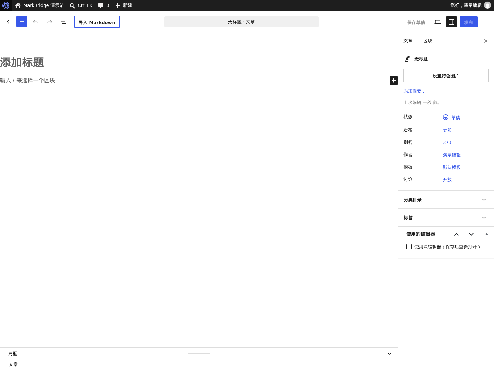
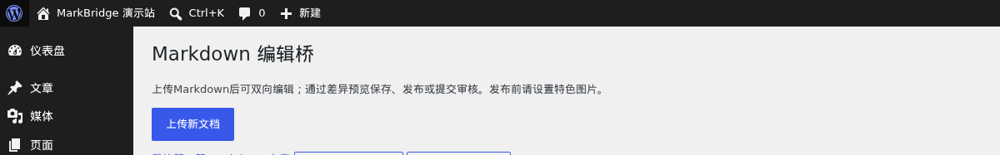
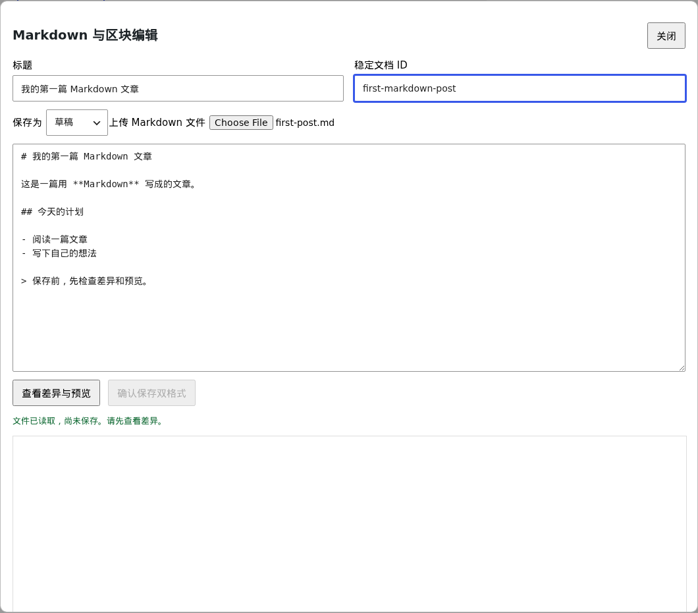

# 第一次使用：上传 Markdown 新建文章

本文带你把电脑上的 `.md` 文件导入 WordPress，保存为草稿，再添加封面并发布。你需要一个已经配置好 MarkBridge 的站点和可以创建文章的账号；如果后台没有插件入口，请先让管理员按[安装指南](INSTALL.md)完成配置。

上传文件只是读取它的正文。MarkBridge 不会把电脑上的文件绑定为服务器源文件，也不会自动更新原文件；以后修改文章，需要手动保存，或再次导入新版 Markdown。

截图来自 MarkBridge 1.2.0 的中文演示环境，使用示例文章；不同 WordPress 版本和主题的按钮位置、外观可能略有不同。

## 1. 准备一个 Markdown 文件

用文本编辑器把下面内容保存为 UTF-8 的 `first-post.md`，也可以用你自己的文件：

```markdown
# 我的第一篇 Markdown 文章

这是一篇用 **Markdown** 写成的文章。

## 今天的计划

- 阅读一篇文章
- 写下自己的想法

> 保存前，先检查差异和预览。
```

先用简单内容走完流程。文件不能超过 1,500,000 字节；内容和请求也有大小限制。正文中的图片链接必须能在站点上访问，导入不会自动上传电脑里的图片。

## 2. 打开导入窗口

在 WordPress 后台进入 **文章 → 新建文章**，点击编辑器顶部的 **导入 Markdown**。



请在空白的新文章上导入。如果你已经输入标题或正文，入口会提示先保存或清空内容；可以先保存已有草稿，再另开一篇空白文章。

另一个入口是 **工具 → Markdown 编辑桥 → 上传新文档**。两个入口打开相同的“Markdown 与区块编辑”窗口，后续步骤相同。



## 3. 选择文件，填写文章信息

在窗口的 **上传 Markdown 文件** 一栏选择 `first-post.md`。正文会出现在 **Markdown 原文** 输入框，页面提示“文件已读取，尚未保存。请先查看差异。”

填写以下信息：

| 字段            | 第一次使用时怎么填                                                                                   |
| --------------- | ---------------------------------------------------------------------------------------------------- |
| **标题**        | 填写 `我的第一篇 Markdown 文章`，这是 WordPress 文章标题。文件名和正文的一级标题不会自动填入此字段。 |
| **稳定文档 ID** | 填写 `first-markdown-post`。它是 MarkBridge 识别文档的标识，不是文章标题或 WordPress 文章编号。      |
| **保存为**      | 选择 **草稿**，先完成导入，再设置封面与发布。                                                        |

文档 ID 必须为 3–64 个字符，以英文字母开头，其余只能用英文字母、数字、下划线或连字符。每篇新文档使用不同 ID；已使用的 ID 不能用来新建第二篇文章。已有文章的 ID 保持不变，修改请打开原文章。



示例中的 `# 我的第一篇 Markdown 文章` 会保留为正文一级标题。如果不希望页面上文章标题与正文标题重复，可以在原文框中删除这一行；上面的 **标题** 字段仍需填写。

文件读取后，你可以直接修改 **Markdown 原文**。这时仍未保存到 WordPress；窗口不会从文件名、正文标题或 YAML front matter 自动填写文章信息。

## 4. 检查预览，确认保存草稿

点击 **查看差异与预览**。等待“校验通过；目标状态：草稿”提示，检查下方的 **修改差异** 和 **内置内容预览**。新文章的差异会显示新增内容。


确认内容正确后，点击 **确认保存草稿**。只有这一步才保存文章；“文件已读取”或“校验通过”都不表示文章已经保存。

成功后会自动跳转到这篇文章的 WordPress 区块编辑器。Markdown 原文和对应区块已一起保存，文章仍是草稿，可在 **文章 → 所有文章** 中找到。

如果预览后改了标题、正文或状态，请再次点击 **查看差异与预览**，再确认保存。预览只是内容检查，最终页面的样式还取决于你的主题。

## 5. 在区块编辑器继续修改

导入后的标题、段落和列表会显示为区块。你可以像编辑普通 WordPress 文章一样调整正文，然后点击 **保存草稿**。


需要修改 Markdown 时，使用编辑器底部的 **Markdown 编辑 / 上传**。在窗口中修改原文，或选择新版文件，然后 **查看差异与预览 → 确认保存草稿**。

普通导入文章可直接使用 WordPress 的保存／更新按钮；MarkBridge 会同步保存两种正文。后台自动保存关闭，请主动保存。无法转换的区块会明确报错，处理方式见[常见问题](TROUBLESHOOTING.md)。

## 6. 添加封面，然后发布

准备公开文章时，在编辑器右侧的文章设置中找到 **特色图片**，选择媒体库中的图片，或使用 WordPress 媒体窗口上传图片。如果右侧设置没有展开，先点击编辑器的设置按钮；具体布局可能随 WordPress 版本变化。

特色图片是文章封面，与 Markdown 正文中的图片不同。新文章公开或私密发布都需要封面；先保存草稿可以在导入窗口没有封面选择器的情况下完成新建。

选择封面、检查文章后，使用 WordPress **发布** 按钮，按其确认步骤完成发布。有发布权限的账号也可以在 **Markdown 编辑 / 上传** 窗口中将 **保存为** 改为 **公开发布** 或 **私密发布**，重新预览，再点击 **确认公开发布** 或 **确认私密发布**。

没有发布权限的账号可保存草稿或选择 **待审核**，预览后点击 **确认提交审核**，由有权限的人员审核发布。草稿和待审核状态不要求封面。

保存成功后，在编辑器使用 **查看文章** 检查实际页面，包括标题、图片和正文排版。私密文章只对 WordPress 授权用户可见。

接下来可阅读[日常编辑指南](USAGE.md)，了解已有文章、公式、任务列表、脚注和历史恢复；遇到错误可先查[常见问题](TROUBLESHOOTING.md)。
