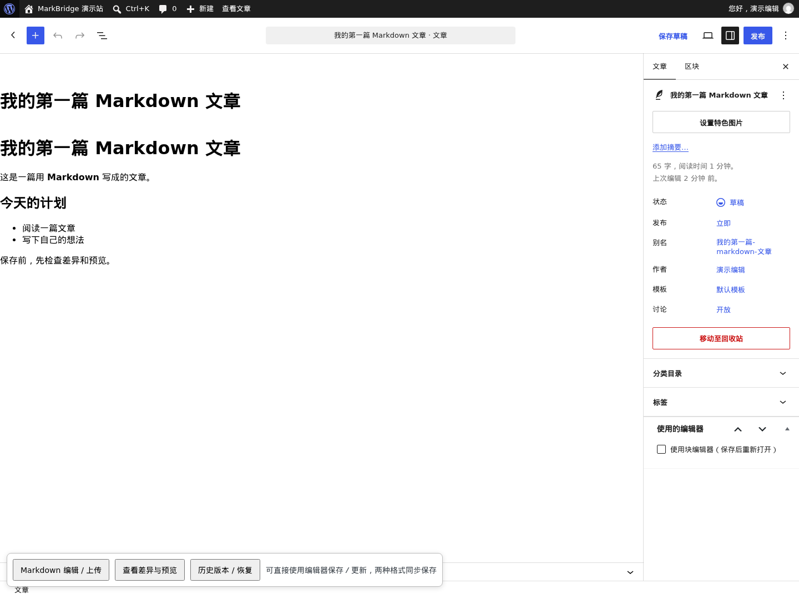
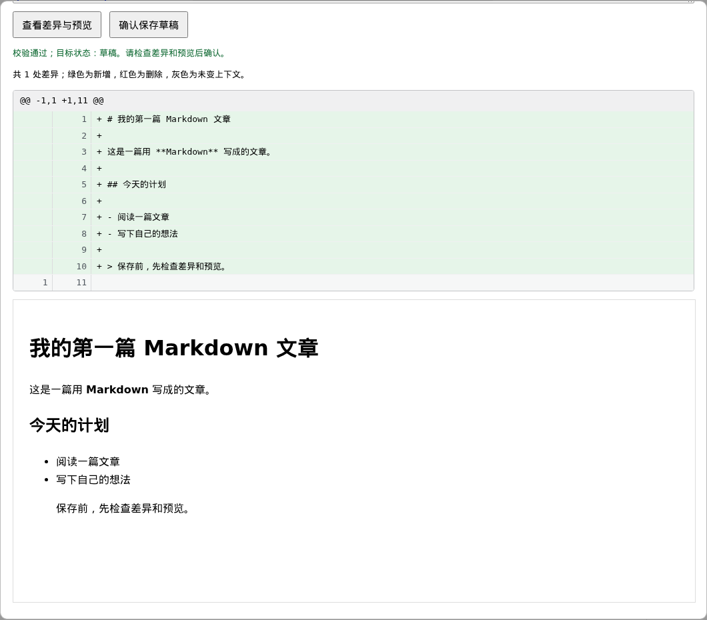
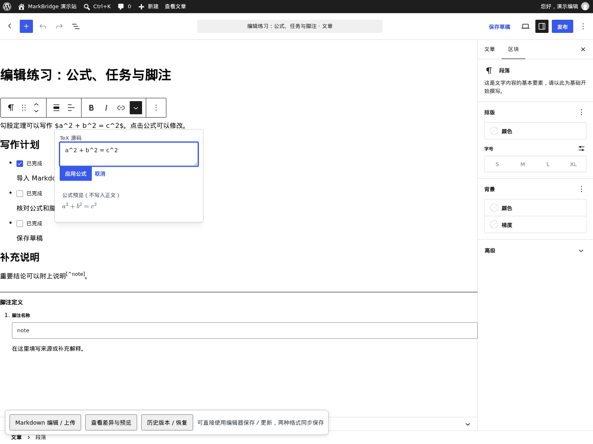
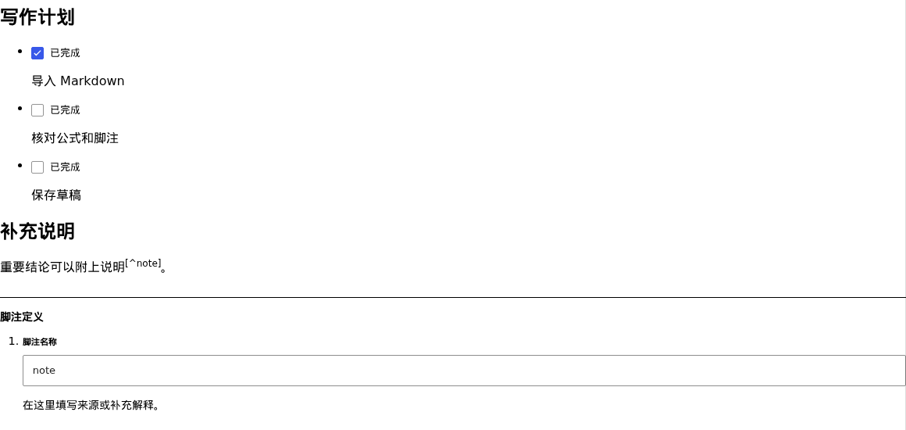

# 编辑与发布

本文适用于 MarkBridge **1.3.0**。先学习已有文章的日常保存，再按需要使用公式、任务列表和脚注；最后介绍冲突处理与历史恢复。第一次创建文章请先看带截图的[快速开始](GETTING-STARTED.md)，遇到错误请查[常见问题](TROUBLESHOOTING.md)，版本变化见[更新记录](../CHANGELOG.md)。

## 选择本次编辑方式

| 你想做什么                     | 从哪里开始                    | 如何保存                               |
| ------------------------------ | ----------------------------- | -------------------------------------- |
| 调整已有文章的段落、列表或标题 | 文章的 WordPress 区块编辑器   | 原生保存／更新／发布按钮               |
| 编辑原文或重新上传 `.md`       | 底部 **Markdown 编辑 / 上传** | 查看差异与预览，再确认目标状态         |
| 修改绑定服务器源文件的文章     | 底部 **Markdown 原文 / 预览** | 配置受信目标后，预览并明确确认写回     |
| 找回已保存的旧稿               | **历史版本 / 恢复**           | 查看恢复差异与预览，再确认恢复两种格式 |

电脑上传的 Markdown 不会自动绑定为服务器源文件；保存文章也不会改写电脑上的原文件。

## 日常编辑与保存

### 在可视化编辑器保存

1. 在 **文章 → 所有文章** 打开已有的 MarkBridge 文章。
2. 修改标题、段落、列表等区块，按需调整文章设置。
3. 点击 WordPress 的 **保存草稿／更新／发布**，等待成功提示。
4. 需要核对原文时，打开底部 **Markdown 编辑 / 上传**；需要核对页面时，使用 WordPress 预览或 **查看文章**。



普通 Markdown 托管文章使用原生按钮保存时，服务器把区块转换回 Markdown，验证可安全往返后，将两份正文和本次原生字段修改一起保存。底部 **查看差异与预览** 是可选检查入口。后台自动保存仍关闭，请主动保存。

遇到无法转换的区块或样式、权限或发布条件不满足、版本冲突时，会显示错误并保留当前编辑内容。先复制重要修改，再处理错误或核对服务器最新版，不要直接刷新丢弃草稿。普通非托管文章的原生流程不受影响。

### 改 Markdown 或上传新版文件

从编辑器底部 **Markdown 编辑 / 上传** 打开窗口；也可以进入 **工具 → Markdown 编辑桥**，选择文章旁的 **Markdown 编辑**。

1. 在 **Markdown 原文** 中修改文字，或选择新版 `.md` 文件。
2. 检查 **标题**、**稳定文档 ID** 和 **保存为**。已有文档的 ID 保持不变。
3. 点击 **查看差异与预览**，核对新增、删除和排版结果。
4. 确认后点击对应的 **确认保存草稿／确认提交审核／确认公开发布／确认私密发布**。



图中为首次导入示例；已有文章会比较当前已保存内容与本次候选。上传、预览均不会保存；预览后再改标题、正文或状态，需要重新预览。重新上传会替换窗口中的候选正文，保存前请检查差异；不要通过 **上传新文档** 重建同一篇文章。

### 添加标题、链接、图片和代码

在可视化编辑器里，点击 **＋** 选择标题、列表、图片或代码区块；选中文字可使用工具栏加粗或添加链接。添加图片时先上传到 WordPress 媒体库，再选择插入。

如果更习惯 Markdown，可以在原文框中这样写：

```markdown
## 小节标题

这是一段 **加粗文字**，以及 [参考链接](https://example.com)。

- 第一项
- 第二项


```

图片地址必须可访问。上传 `.md` 不会一起上传电脑中的图片，也不会把 `./images/photo.png` 自动变成媒体库链接。代码可使用 Markdown 围栏（以三个反引号开头和结尾），并在开头注明 `python` 等语言名称；粘贴到代码区块里的 `$`、脚注和任务标记都会作为代码保留。

保存前可使用预览检查排版。遇到复杂第三方区块或不能往返的样式，插件会明确拒绝保存，原编辑内容保留；处理办法见[常见问题](TROUBLESHOOTING.md)。

### 草稿、审核与发布

首次导入建议先保存草稿，再在文章设置中选择 **特色图片**。有发布权限时可公开或私密发布；没有发布权限时可保存草稿或提交审核。新文章公开／私密发布需要媒体库中的有效特色图片，正文图片不能代替封面。完整步骤见[快速开始](GETTING-STARTED.md#6-添加封面然后发布)。

更换封面后，在文章编辑器保存；编辑器内打开的 Markdown 窗口也会读取当前选择的特色图片。在工具页打开窗口不提供封面选择器。

### 编辑服务器文件来源文章

显示 **正文由源文件同步** 的文章由管理员绑定服务器源文件。配置了受信写回目标并通过权限与双端版本校验后，才能编辑、预览并明确确认写回；普通原生保存不能替代确认。

未配置写回目标时只读。绑定文件无法读取时显示 WordPress 已保存副本并保持只读，该副本可能不是源文件最新版；请联系管理员。CLI 同步、绑定路径和回退细节见[服务器配置](RUNTIME.md#升级与历史迁移)。

## 公式

### 编辑已有行内公式

区块编辑器默认显示行内公式的排版结果。

1. 点击公式，或聚焦后按 Enter / 空格，打开 TeX 输入框与小型预览。
2. 修改源码，选择 **应用公式**；取消或 Esc 保留原值。
3. 使用文章保存按钮保存。文件来源文章仍需预览并确认写回。



保存成功后，排版公式与 Markdown 中的 TeX 一起保存。

<details>
<summary>注意事项与兼容边界</summary>

应用公式只修改编辑内容，还没有保存文章。排版失败时保留源码；浮层打开期间公式发生变化时，需要重新选择，避免覆盖新内容。预览节点不会写入正文。

</details>

### 新建行内公式

在 MarkBridge 托管文章中：

1. 在正文富文本工具栏的 **更多** 中选择 **数学（MathJax）**；也可以先选中一段纯文本，以它作为 TeX 初值。
2. 输入不带外层美元符的单行 TeX，例如 `a^2 + b^2 = c^2`。
3. 等待预览成功，选择 **应用公式**，再保存文章。取消不会修改正文。

也可以在正文中逐字键入 `$a = b$`，闭合美元符后自动变成行内公式；一次撤销可恢复完整字面文字。有歧义或较长的公式请使用工具栏。

<details>
<summary>注意事项与兼容边界</summary>

含其他格式或对象的选区不能直接替换，以免丢失格式。自动识别只处理本次短文本输入，不扫描旧内容，不处理粘贴、输入法组合过程、代码或带其他格式的范围。

金额、转义美元符和未闭合表达式保持文字；相邻公式请用空格或文字分隔，或合并为一个 TeX 公式。紧接已有公式的第二段 `$…$` 保持字面文字，避免中间 `$$` 与行间分隔符歧义。普通文字中的美元符仍会在 Markdown 中转义，不能通过取消转义来强制识别。

</details>

### 新建行间公式

在空段落仅键入 `$$` 后按 Enter，可创建 **行间公式** 区块并进入 TeX 输入框；也可从区块插入器选择 **行间公式**。

选中时编辑源码，离开后显示排版结果。应用或插入公式仍需保存文章；文件来源文章仍需差异预览和明确确认。

### 转换 WordPress 原生数学

核心的 **数学** 与插件的 **数学（MathJax）** 使用两种存储格式。插件保留核心格式注册和已有内容，不会自动迁移文章；托管文章的新建行间入口使用插件的 **行间公式**，普通非托管文章保持原生入口。

| 当前选中内容 | 直接转换入口                           |
| ------------ | -------------------------------------- |
| 原生行内数学 | 公式旁 **转换为行内公式（MathJax）**   |
| 原生数学区块 | 区块上方 **转换为行间公式（MathJax）** |

点击入口发起核对，原工具栏入口也保留。转换成功后才进入既有双格式保存链，请继续保存文章。保存后使用插件的公式格式显示，原文仍保留 TeX。

<details>
<summary>注意事项与兼容边界</summary>

只有可恢复的 TeX、可核对的 MathML 且没有会丢失的额外属性时才允许转换。缺少源码、样式不能保留、排版失败或验证期间内容变化都会拒绝，保留原对象；不会放宽对任意 MathML 或 HTML 的保存限制。

</details>

## 任务列表

### 添加与修改任务

1. 在区块插入器选择 **任务列表**。
2. 输入任务内容，在后台勾选或取消勾选完成状态。
3. 使用文章保存按钮保存；Markdown 编辑或文件写回仍需差异预览与确认。

也可以在 Markdown 中使用 `- [ ]` 和 `- [x]`（接受 `[X]`）：

```markdown
- [ ] 核对文章内容
- [x] 完成草稿
```



保存后，Markdown 与区块会保留任务状态。读者能在前台看到完成状态，复选框只读；更改任务请回后台编辑。

<details>
<summary>注意事项与兼容边界</summary>

支持普通项混排、有序列表、嵌套、后续段落、引用、代码与公式。转义标记和代码内容不作为任务，不自动迁移既有文章。

删除最后一个任务后，如果剩余内容可表示为普通列表，选中列表容器，在区块工具栏中选择 **转换为普通列表** 再导出。复杂的多段落普通列表继续保留原区块。两个独立的同类列表之间需要正文段落分隔；紧邻列表在 Markdown 中会合并，无法保留原区块结构时会拒绝导出。

历史复杂列表中作为普通段落保存的 `[x]` 仍可精确恢复旧配对，但前台显示字面标记；显式重新导入原 Markdown 后才使用新的任务状态区块。

</details>

## 脚注

### 在 Markdown 中写脚注

使用命名引用与定义；脚注名称支持 1–64 个字母（含中文）、数字、下划线或连字符，区分大小写：

```markdown
正文中的说明[^note]，再次引用[^note]。

[^note]: 第一段说明。

    第二段说明，也可以包含已有支持的列表、代码或公式。
```

### 在区块编辑器中编辑

1. 在正文富文本工具栏的 **更多** 中选择 **插入或修改脚注引用**，填写名称。
2. 在文末插入 **脚注定义** 区块，填写同名名称并编辑说明内容。
3. 使用文章保存按钮保存；也可以在 Markdown 编辑桥中编辑，检查差异与预览后确认保存。

### 保存后的阅读效果

前台按首次引用顺序编号，重复引用分别提供返回链接；同页多篇文章互不串跳。保存时保留定义顺序，不把阅读编号写回 Markdown。删除引用时同时删除不再使用的定义。

<details>
<summary>注意事项与兼容边界</summary>

引用改名后须修改对应定义及其他引用，否则配对校验会拒绝保存。缺失、重复、未使用的定义、脚注定义中的脚注引用、链接或图片文字中的引用会明确拒绝。匿名 `^[说明]`、原生 WordPress 脚注区块或第三方脚注格式不自动转换。代码与转义文字保持字面；历史普通文字中的未定义标记仅允许精确恢复旧配对，不自动迁移。

</details>

## 冲突与旧文件

如果服务器文章或源文件在编辑期间发生变化，保存会被阻止，编辑桥显示 **版本冲突：核对服务器与当前候选**。

1. 先点击 **下载当前候选 .md** 保留修改；候选不能转换时复制重要文字并保留编辑页。
2. 点击 **重新读取服务器最新版**，比较标题、状态与正文差异。
3. 核对后点击 **保留我的修改，基于最新版继续**，手动合并需要保留的内容。
4. 再次 **查看差异与预览**，确认后保存。

“基于最新版继续”只更新核对基准，不会自动合并或保存正文。原生保存遇到冲突时，也先保留当前修改，再核对服务器最新版；不要直接刷新。

上传提示“已知旧版本”时，文件曾是该文档的历史内容，不能直接覆盖服务器更新。需要取回其中部分内容时合并原文；要恢复整份旧稿，使用下一节的配对恢复。其他错误见[常见问题](TROUBLESHOOTING.md)。

## 历史恢复与删除

### 同时恢复 Markdown 与区块

1. 先保存当前修改，或另行复制保留。编辑器有未保存修改时不能恢复。
2. 点击底部或编辑桥列表中的 **历史版本 / 恢复**。
3. 选择历史版本，点击 **查看恢复差异与预览**；此时尚未恢复。
4. 检查后点击 **确认恢复两种格式**。

文件来源文章不能从此入口直接恢复，请通过既有源文件同步流程处理。

恢复所选版本的标题、Markdown 与区块；当前已保存版本保留在历史记录中。文章 ID、作者和可见性保持不变。历史配对不兼容、损坏或不能验证时会拒绝恢复，保留当前文章；不要只还原其中一种正文。

### 移至回收站或还原文章

在 **文章 → 所有文章** 中移至回收站；需要找回时进入 **回收站 → 还原**。移入回收站不会丢弃两种正文，编辑桥列表不显示回收站文章；永久删除请使用 WordPress 回收站操作。

服务器文件来源的外部文件不会随 WordPress 文章删除，源文件与同步映射由管理员另行维护。
